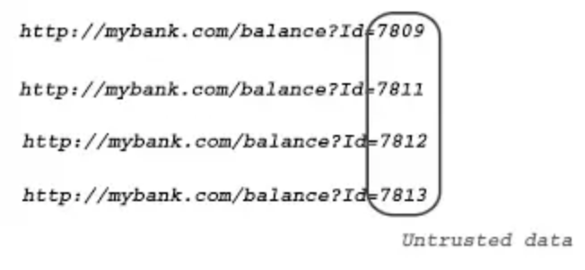

## What is access control?

Access control is the application of constraints on who or what is authorized to perform actions or access resources. In the context of web applications, access control is dependent on authentication and session management:

- __Authentication__ confirms that the user is who they say they are.
- __Session management__ identifies which subsequent HTTP requests are being made by that same user.
- __Access control__ determines whether the user is allowed to carry out the action that they are attempting to perform.

Broken access controls are common and often present a critical security vulnerability. Design and management of access controls is a complex and dynamic problem that applies business, organizational, and legal constraints to a technical implementation. Access control design decisions have to be made by humans so the potential for errors is high.

### Vertical access controls

Vertical access controls are mechanisms that restrict access to sensitive functionality to specific types of users.

With vertical access controls, different types of users have access to different application functions.

For example, an administrator might be able to modify or delete any user's account, while an ordinary user has no access to these actions.

### Horizontal access controls

Horizontal access controls are mechanisms that restrict access to resources to specific users.

With horizontal access controls, different users have access to a subset of resources of the same type. For example, a banking application will allow a user to view transactions and make payments from their own accounts, but not the accounts of any other user.

### Context-dependent access controls

Context-dependent access controls restrict access to functionality and resources based upon the state of the application or the user's interaction with it.

Context-dependent access controls prevent a user performing actions in the wrong order. For example, a retail website might prevent users from modifying the contents of their shopping cart after they have made payment.


## What are insecure direct object references (IDOR)? (OWASP 2007 Top Ten)

Insecure Direct Object Reference (IDOR) is a vulnerability that arises when attackers can access or modify objects by manipulating identifiers used in a web application's URLs or parameters. It occurs due to missing access control checks, which fail to verify whether a user should be allowed to access specific data.

### When does is occur?

For instance, when a user accesses their profile, the application might generate a URL like this:

```
https://example.org/users/123
```

The 123 in the URL is a direct reference to the user's record in the database, often represented by the primary key. If an attacker changes this number to 124 and gains access to another user's information, the application is vulnerable to Insecure Direct Object Reference. This happens because the app didn't properly check if the user had permission to view data for user 124 before displaying it.

In some cases, the identifier may not be in the URL, but rather in the POST body, as shown in the following example:

```
<form action="/update_profile" method="post">
  <!-- Other fields for updating name, email, etc. -->
  <input type="hidden" name="user_id" value="12345">
  <button type="submit">Update Profile</button>
</form>
```

### How to detect?



__Test Vertical access controls__

__Test Horizontal access controls__

### How to exploit?

.....

### How to prevent?

- Unless a resource is intended to be publicly accessible, deny access by default.

- Make it mandatory for developers to declare the access that is allowed for each resource, and deny access by default

- Use UID

- Avoid exposing identifiers in URLs and POST bodies if possible. Instead, determine the currently authenticated user from session information. When using multi-step flows, pass identifiers in the session to prevent tampering.


