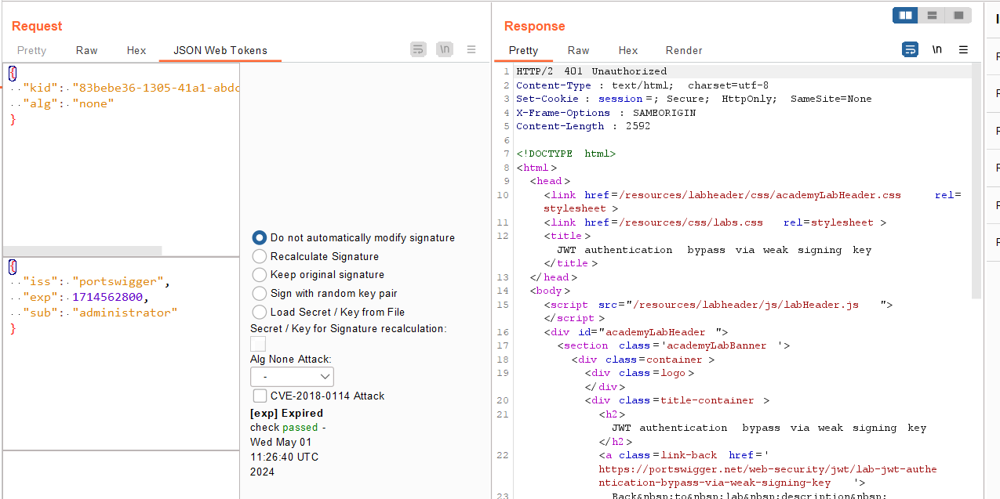
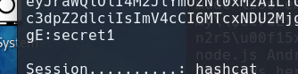

## JWT authentication bypass via unverified signature

Sau khi đăng nhập wiener, ta thử url /admin -> bị chặn

Ta thấy sự xuất hiện của JWT, thử sửa sub thành `administrator`

Giờ ta đã bypass authentication, giờ chỉ cần xóa user carlos là được.

## JWT authentication bypass via flawed signature verification

Tương tự như trên:

Ở lần này, ta sửa alg: none 

Như vậy đã bypass

## Lab: JWT authentication bypass via weak signing key

Lab này ta sẽ brute-force để tìm signing key, lỗi này do key yếu hoặc cop code về không sửa key

-> Thử bypass bằng cách trên nhưng không được.

Giờ ta brute-force tìm key, chú ý ở đây thuật toán là HS256

Ở đây ta đã tìm dc key: `secret1`

Ta điền key rồi generate ra signature

Paste vào cookie rồi chạy

Vậy đã bypass được.