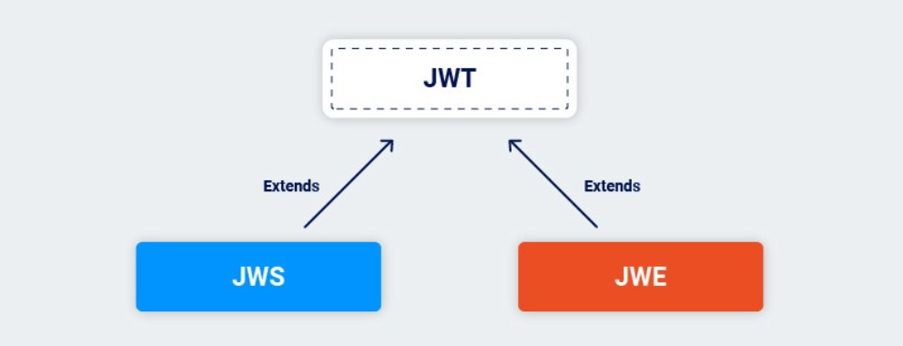

# JWT

### Why using JWT?

The HTTP protocol is stateless, this means a new request (e.g. GET /order/42) won’t know anything about the previous one, so we need to reauthenticate for each new request.


The traditional way of dealing with this is the use of Server Side Sessions (SSS). In this scenario, we first check for username and password; if they are authentic, the server will save a session id in memory and return it to the client. From now on, the client will just need to send its `session` id to be recognized.


=> This solution will fix a problem but it will create another one.


=> How to fix:
- Synchronize sessions between servers — tricky and error-prone;
- Use an external in-memory database — good solution, but it will add another component to the infrastructure;
- Third: embrace the stateless nature of HTTP and search for a better solution!

=> JWT

### What are JWTs?

JSON web tokens (JWTs) are a standardized format for sending cryptographically signed JSON data between systems. They can theoretically contain any kind of data, but are most commonly used to send information ("claims") about users as part of authentication, session handling, and access control mechanisms.

Unlike with classic session tokens, all of the data that a server needs is stored client-side within the JWT itself.

### When do we use JWT?

- Authorization: when user login, each request is sent by client include JWT, allow user to access the routes, services, and resources allowed with the token.

- Information Exchange: Using public/private key, you can know the sender. Additional, because the signature based on the header and payload, so you can verify that the content haven't not been change.

### JWT format

A JWT consists of 3 parts: a header, a payload, and a signature. These are each separated by a dot.

JWT look like:

```
xxxxx.yyyyy.zzzzz
```

__Header__

Header includes 2 part: type of token, algorithm to encode

```json
{
  "alg": "HS256",
  "typ": "JWT"
}
```

This JSON is encoded with Base64URL to create a first part of JWT.

__Payload__

Payload has claims. Claims have lots of properties: typically, user's information,...

There are 3 types of claims:

1. __Registered claims__: is not required, but recommended. It provide lots of useful claims: iss(nhà phát hành), exp(thời gian hết hạn), sub(chủ đề), aud(audience),... Claims name also have 3 characters. 

2. __Public claims__: identified by JWT user.  

3. __Private claims__: These are custom claims created to share information between parties who agree to use them and are not registered or public claims.

Example of payload: 

```json
{
      "sub": "1234567890",
      "name": "John Doe",
      "admin": true
}
```

Then the payload is encoded with Base64Url to create a 2nd part of JWT.

__Note__: Do not include security information in JWT payload or header elements unless encrypted because everyone can read.

__Signature__

To create signature, you must take encrypt header and encrypt payload, secret, algorithm and sign in header. Example with HMAC SHA256:

```
HMACSHA256(
  base64UrlEncode(header) + "." +
  base64UrlEncode(payload),
  secret)
```

RS256


Signature is used to verify the message won't be changed. In case the token is signed with a private key, it can also verify the JWT sender.

### How do JWT work?


1. Application or client requests authorization to authorization server. 

2. When authorization is provided, the authorization server will return the access token to the application.

3. Application will use access token to access resource (like API). 

### Types of JWT?

There are 2 types of JWT: JWS, JWE

- The data in a JWS is public—meaning anyone with the token can read the data—whereas a JWE is encrypted and private. To read data contained within a JWE, you need both the token and a secret key.

- When you use a JWT, it’s usually a JWS. The 'S' (the signature) is the important part and allows the token to be validated. 




### How to verify signature?

- Signing Input: this is the base64Url encoded header and the base64Url encoded payload, concatenated with a `.`
 

- Hashing(SHA256 hashing algorithm): 
  - Hashing is irreversible. 
  - Hashing will always produce the same output for the same input.
  - No two different hashing inputs will produce the same output.

- Encryption: RSA, which is an asymmetric signing algorithm and uses one key to encrypt tokens, and another key to decrypt them.
- 

1. Decode Claims => check algorithm in header. If it doesn't match, we should reject the token.

2. Hashing (Again) => hash SHA256 header, payload.

3. Decrypt: decrypt signature => gain hash signature

4. Compare Hashes + Verifying Token Claims


### What are JWT attacks?

JWT attacks involve a user sending modified JWTs to the server in order to achieve a malicious goal. Typically, this goal is to bypass authentication and access controls by impersonating another user who has already been authenticated.

### What is the impact of JWT attacks?

If an attacker is able to create their own valid tokens with arbitrary values, they may be able to escalate their own privileges or impersonate other users, taking full control of their accounts.

### How do vulnerabilities to JWT attacks arise?

JWT vulnerabilities arise due to flawed JWT handling. These implementation flaws usually mean that the signature of the JWT is not verified properly. This enables an attacker to tamper with the values passed to the application via the token's payload. Even if the signature is verified, whether it can truly be trusted relies heavily on the server's secret key remaining a secret. If this key is leaked in some way, or can be guessed or brute-forced, an attacker can generate a valid signature for any arbitrary token, compromising the entire mechanism.

### How to exploit?

__Exploiting flawed JWT signature verification__

By design, servers don't usually store any information about the JWTs that they issue. Instead, each token is an entirely self-contained entity. This has several advantages, but also introduces a fundamental problem - the server doesn't actually know anything about the original contents of the token, or even what the original signature was. Therefore, if the server doesn't verify the signature properly, there's nothing to stop an attacker from making arbitrary changes to the rest of the token.

```json
{
    "username": "carlos",
    "isAdmin": false
}
```

If the server identifies the session based on this username, modifying its value might enable an attacker to impersonate other logged-in users. Similarly, if the isAdmin value is used for access control, this could provide a simple vector for privilege escalation.

- Accepting arbitrary signatures

> JWT libraries typically provide one method for verifying tokens and another that just decodes them. For example, the Node.js library jsonwebtoken has verify() and decode().

> Occasionally, developers confuse these two methods and only pass incoming tokens to the decode() method. This effectively means that the application doesn't verify the signature at all.

- Accepting tokens with no signature

> JWTs can be signed using a range of different algorithms, but can also be left unsigned. In this case, the alg parameter is set to `none`, which indicates a so-called "unsecured JWT". Due to the obvious dangers of this, servers usually reject tokens with no signature. However, as this kind of filtering relies on string parsing, you can sometimes bypass these filters using classic obfuscation techniques, such as mixed capitalization and unexpected encodings.

```json
{
    "alg": "none",
    "typ": "JWT"
}
```

> Note: Even if the token is unsigned, the payload part must still be terminated with a trailing dot.

__Brute-forcing secret keys__

When implementing JWT applications, developers sometimes make mistakes like forgetting to change default or placeholder secrets. They may even copy and paste code snippets they find online, then forget to change a hardcoded secret that's provided as an example. In this case, it can be trivial for an attacker to brute-force a server's secret using a wordlist of well-known secrets.

- Brute-forcing secret keys using hashcat

> Using hashcat to brute-force secret keys.

> ```
> hashcat -a 0 -m 16500 <jwt> <wordlist>
> ```

> Result: `<jwt>:<identified-secret> `

__JWT header parameter injections__

According to the JWS specification, only the alg header parameter is mandatory. In practice, however, JWT headers (also known as JOSE headers) often contain several other parameters:


-> These user-controllable parameters each tell the recipient server which key to use when verifying the signature.

- Injecting self-signed JWTs via the `jwk` parameter

> A JWK (JSON Web Key) is a standardized format for representing keys as a JSON object

> Example: 

>```
> {
>    "kid": "ed2Nf8sb-sD6ng0-scs5390g-fFD8sfxG",
>    "typ": "JWT",
>    "alg": "RS256",
>    "jwk": {
>        "kty": "RSA",
>        "e": "AQAB",
>        "kid": "ed2Nf8sb-sD6ng0-scs5390g-fFD8sfxG",
>        "n":"yy1wpYmffgXBxhAUJzHHocCuJolwDqql75ZWuCQ_cb33K2vh9m"
>    }
> }
>``` 

> Ideally, servers should only use a limited whitelist of public keys to verify JWT signatures. However, misconfigured servers sometimes use any key that's embedded in the jwk parameter.

> You can exploit this behavior by signing a modified JWT using your own RSA private key, then embedding the matching public key in the jwk header.

- Injecting self-signed JWTs via the `jku` parameter

> Instead of embedding public keys directly using the jwk header parameter, some servers let you use the jku (JWK Set URL) header parameter to reference a JWK Set containing the key. When verifying the signature, the server fetches the relevant key from this URL.

> A JWK Set is a JSON object containing an array of JWKs representing different keys. You can see an example of this below.

```json
{
    "keys": [
        {
            "kty": "RSA",
            "e": "AQAB",
            "kid": "75d0ef47-af89-47a9-9061-7c02a610d5ab",
            "n": "o-yy1wpYmffgXBxhAUJzHHocCuJolwDqql75ZWuCQ_cb33K2vh9mk6GPM9gNN4Y_qTVX67WhsN3JvaFYw-fhvsWQ"
        },
        {
            "kty": "RSA",
            "e": "AQAB",
            "kid": "d8fDFo-fS9-faS14a9-ASf99sa-7c1Ad5abA",
            "n": "fc3f-yy1wpYmffgXBxhAUJzHql79gNNQ_cb33HocCuJolwDqmk6GPM4Y_qTVX67WhsN3JvaFYw-dfg6DH-asAScw"
        }
    ]
}
```

- Injecting self-signed JWTs via the kid parameter

> Servers may use several cryptographic keys for signing different kinds of data, not just JWTs. For this reason, the header of a JWT may contain a kid (Key ID) parameter, which helps the server identify which key to use when verifying the signature.

> Verification keys are often stored as a `JWK Set`. In this case, the server may simply look for the `JWK` with the same kid as the token. However, the JWS specification doesn't define a concrete structure for this ID - it's just an arbitrary string of the developer's choosing. For example, they might use the kid parameter to point to a particular entry in a database, or even the name of a file.

> If this parameter is also vulnerable to directory traversal, an attacker could potentially force the server to use an arbitrary file from its filesystem as the verification key.

> This is especially dangerous if the server also supports JWTs signed using a symmetric algorithm. In this case, an attacker could potentially point the `kid` parameter to a predictable, static file, then sign the JWT using a secret that matches the contents of this file.

> You could theoretically do this with any file, but one of the simplest methods is to use `/dev/null`, which is present on most Linux systems. As this is an empty file, reading it returns an empty string. Therefore, signing the token with a empty string will result in a valid signature.

### How to prevent JWT attacks

- Use an up-to-date library for handling JWTs and make sure your developers fully understand how it works, along with any security implications.

- Make sure that you perform robust signature verification on any JWTs that you receive, and account for edge-cases such as JWTs signed using unexpected algorithms.

- Enforce a strict whitelist of permitted hosts for the jku header.

- Make sure that you're not vulnerable to path traversal or SQL injection via the kid header parameter.

- Always set an expiration date for any tokens that you issue.

- Avoid sending tokens in URL parameters where possible.

- Include the aud (audience) claim (or similar) to specify the intended recipient of the token. This prevents it from being used on different websites.

- Enable the issuing server to revoke tokens (on logout, for example).