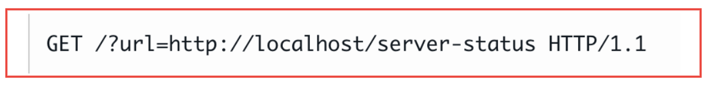

# Server-side request forgery (SSRF)

## What is SSRF?

Server-side request forgery (SSRF) is a vulnerability that lets a malicious hacker send a request from the back end of the software to another server or to a local service. The server or service that receives that request believes that the request came from the application and is legitimate.


## Where does SSRF occur?

When the attacker can input or influence a third-party service URL to which the web application makes a request.




## Type of SSRF

__Full response__ 


__Blind__

No response content return for client-side but server-side even makes a requests to target

## What is the impact of SSRF attacks?

- Unauthorized data access: Attackers can abuse SSRF to retrieve sensitive data from internal systems, such as databases, file servers, or cloud services.

- Service disruption: SSRF can cause denial-of-service (DoS) attacks by overwhelming external systems with requests, impacting their availability.

- Remote code execution: By leveraging SSRF, attackers can execute arbitrary code on internal systems, leading to further compromise or lateral movement within the network.

## How to detect SSRF vulnerabilities?

- Identify user-controlled inputs: Look for inputs, such as URLs, IP addresses, or file paths, that are processed or used in requests originating from the server.
- Check for URL validations.
- Analyze request patterns: Identify code patterns that indicate server-side requests.
- Check User-Agent

## How to exploit SSRF vulnerabilities?

__Access a Restricted Page__

```
GET https://example.com/page?page=http://localhost/admin
```

__Enumerate Internal Network__

```
GET /fetch?url=http://192.168.0.1
```

__Fetch a Local File__

```
GET https://example.com/page?page=file:///etc/passwd
```

__Bypass Filters and Restrictions__

URL encoding: `http://127.0.0.1%3A80`

Use an alternative IP representation of 127.0.0.1, such as 2130706433(decimal), 017700000001(octal), or 127.1.

Register your own domain name that resolves to 127.0.0.1 (spoofed.burpcollaborator.net)

### Blind SSRF

Out of band: Use Burp collab

## Prevent

Use whitelist for URLs and IP addresses

Create an allowlist of trusted domains

Sanitize user input