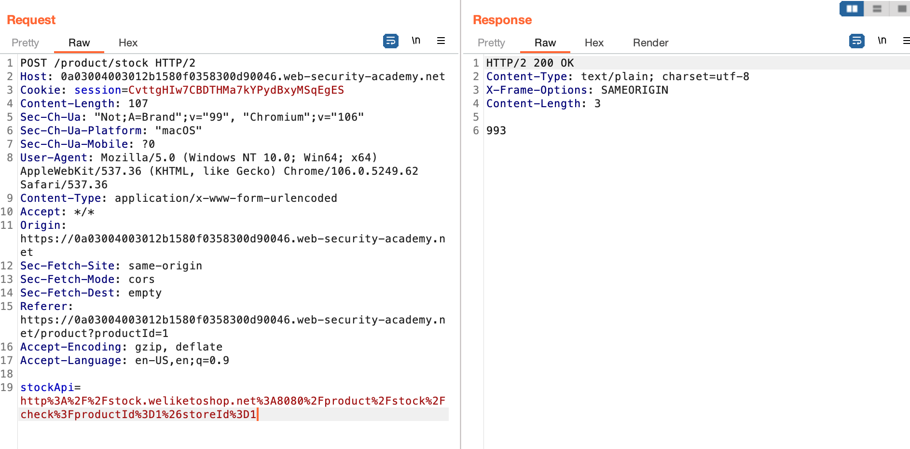
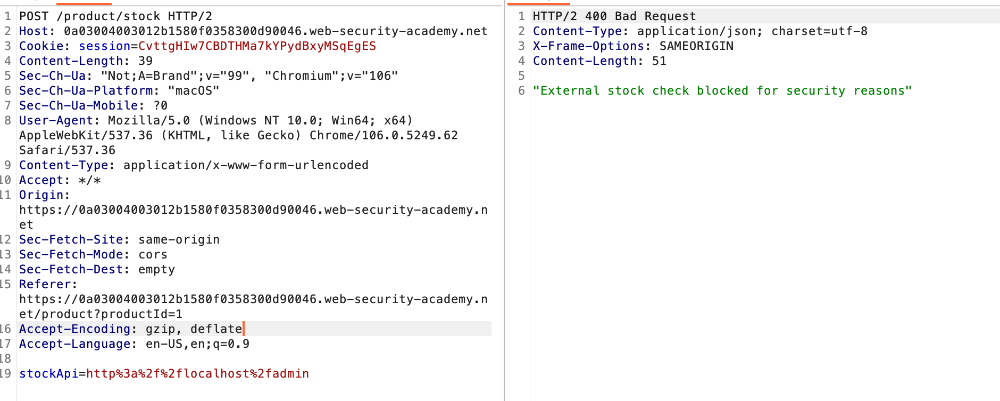
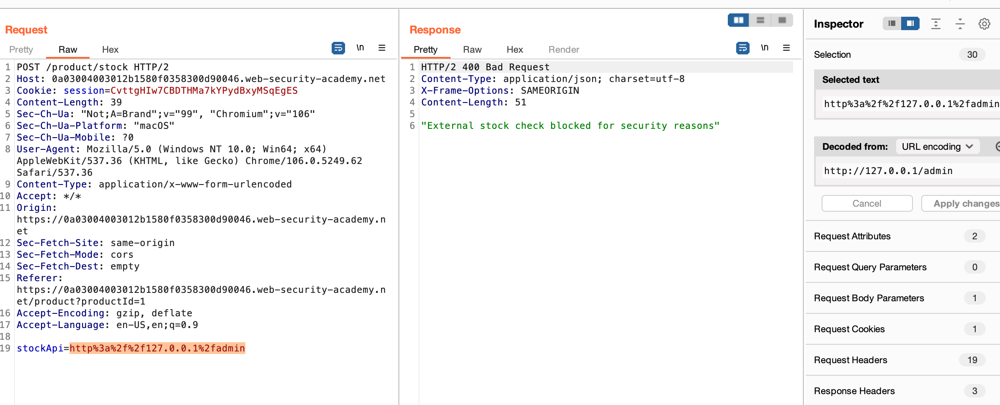
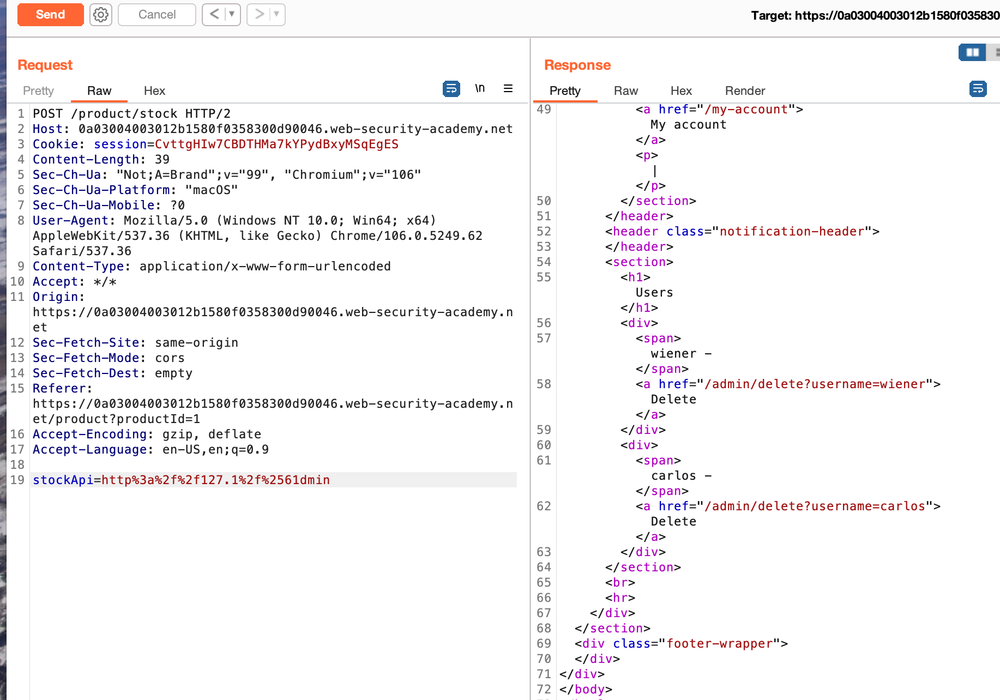
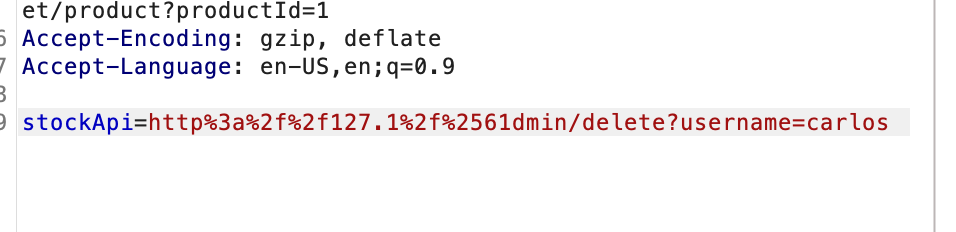

## Lab: SSRF with blacklist-based input filter

Khi nhấn check stock -> api như hình

ta thử chèn localhost xemm sao

-> Ăn black list

đổi sang 127.0.0.1 hay 127.1 vẫn ăn black list

thử urlencode 'a' -> %2561

Done!

