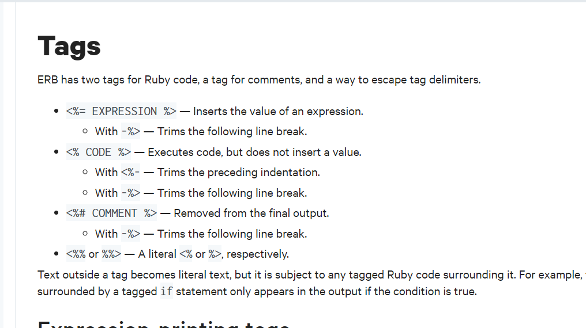

## Lab: Basic server-side template injection

Trang web này đang sử dụng template là ERB

Thử bấm vô views detail cái đầu tiên, bắn ra 1 cái message ở query string parameter.

Trước tiên thì ta cần phải biết syntax của ERB, trông khá giống EJS 

Thử inject `<%= 7*7 %>`

=> SSTI

`<%= system("whoami") %>`

Vậy ta có user hiện tại là carlos

Ta dùng `<%= Dir.entries('/') %>` để liệt kê tất cả các folder hiện tại

Đã tìm ra file morale.txt, giờ chỉ cần remove đi là được.

`<%= system("rm /home/carlos/morale/txt") %>`

## Lab: Basic server-side template injection (code context)

Ta dùng {{ 7*7 }} để xem kết quả

Quay trở lại trang account, khi ta submit name:

Giờ thử điền thêm vài kí tự vào user.name để xem lỗi

=> template: tornado

Ta import os, sau đó check user-> carlos

Vậy là payload đã được execute, ta hình dung được file được render là:

`{{user.name}}  {{os.system('whoami')}}`

## Lab: Server-side template injection using documentation

Template: Freemaker

Như vậy là done

## Lab: Server-side template injection in an unknown language with a documented exploit

Đầu tiên bấm vào view details -> message    

Ta truyền 1 chuỗi kí tự: `${{<%[%'"}}%\` mục đích nhằm bắn ra error để biết được template

Ở đây là handlebars của nodejs