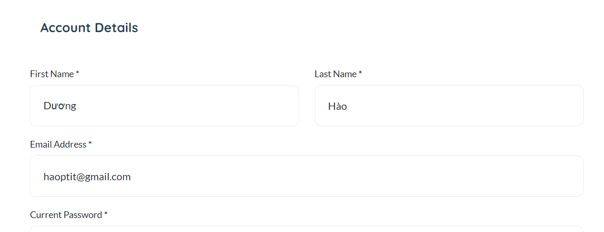
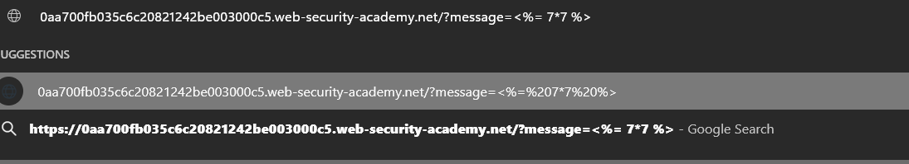
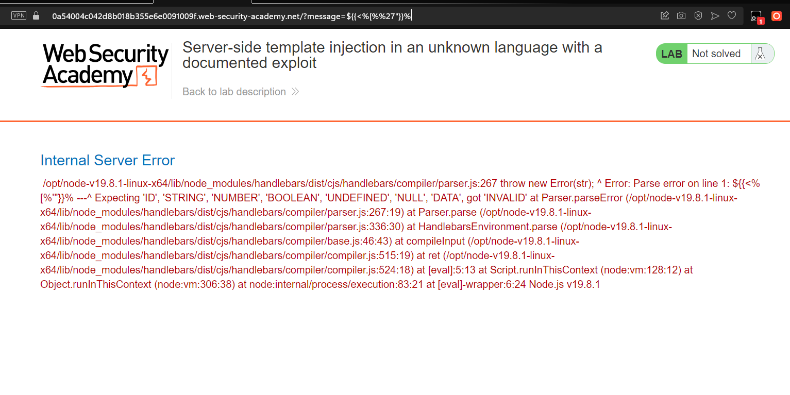
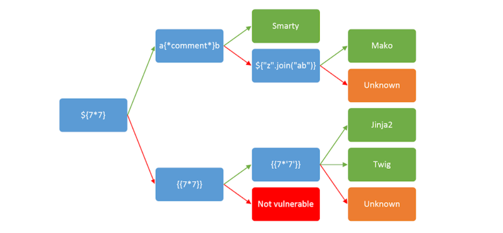
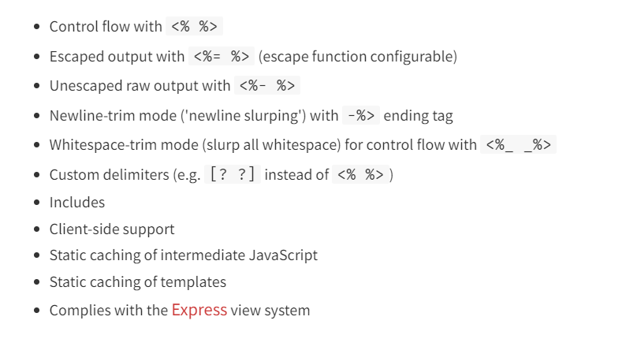
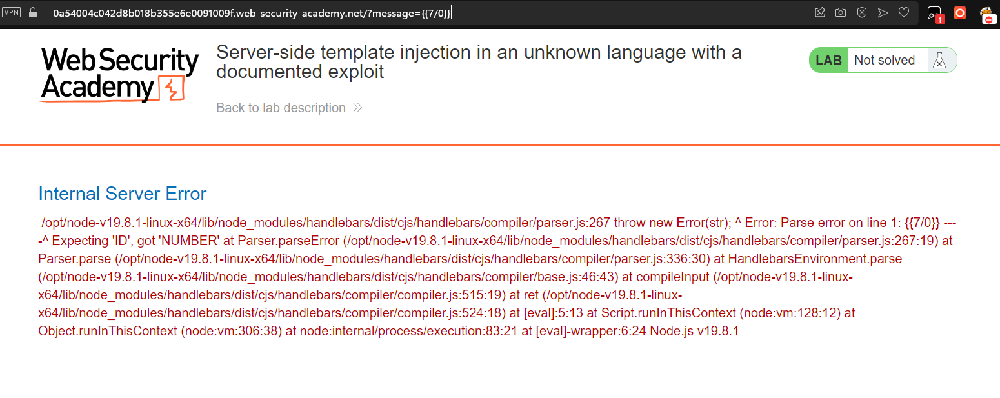
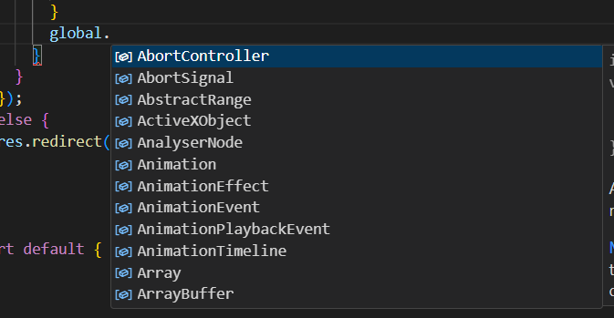
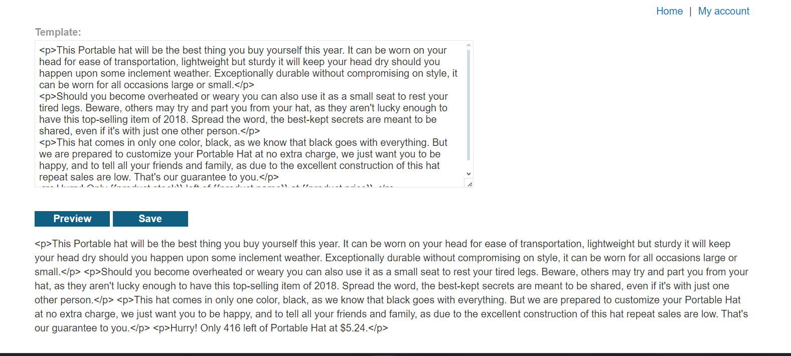
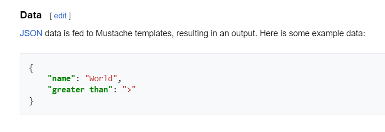
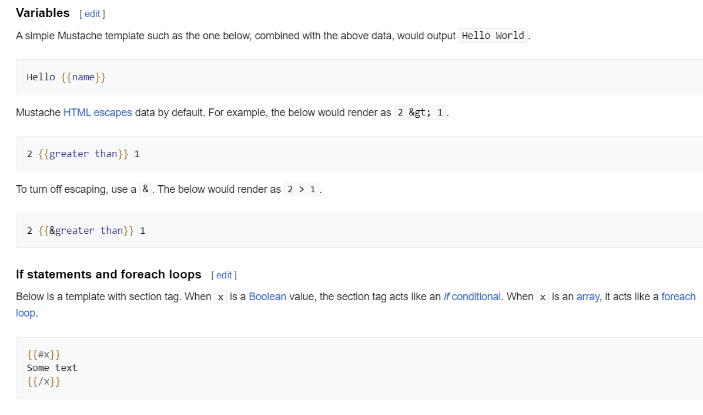

# Server Side Template Injection

### What is SSTI?
Server Side Template Injection (SSTI) is a web exploit (server side exploit) which takes advantage of an insecure implementation of a template engine.

At the severe end of the scale, an attacker can potentially achieve remote code execution, taking full control of the back-end server and using it to perform other attacks on internal infrastructure.

Even in cases where full remote code execution is not possible, an attacker can often still use server-side template injection as the basis for numerous other attacks, potentially gaining read access to sensitive data and arbitrary files on the server.
### Where does SSTI occur?

```python
from flask import Flask, render_template_string
app = Flask(__name__)

@app.route("/profile/<user>")
def profile_page(user):
    template = f"<h1>Welcome to the profile of {user}!</h1>"

    return render_template_string(template)

app.run()
```

The variable user (which is user input) is concatenated directly into the template, rather than passed in as data. This means whatever is supplied as user input will be interpreted by the engine.

__Note__: The template engines themselves aren't vulnerable, rather an insecure implementation by the developer.

### How to detect?

The exploit must be inserted somewhere, this is called an injection point such as the URL or an input box.

Input



URL



__Fuzzing__

Fuzzing is a technique to determine whether the server is vulnerable by sending multiple characters in hopes to interfere with the backend system.

Most template engines will use a similar character which makes it relatively quick to detect if it's vulnerable to SSTI.

Example: `${{<%[%'"}}%`



__Plaintext context__

Most template languages allow you to freely input content either by using HTML tags directly or by using the template's native syntax, which will be rendered to HTML on the back-end before the HTTP response is sent.

By setting mathematical operations as the value of the parameter, we can test whether this is also a potential entry point for a server-side template injection attack.

For example, consider a template that contains the following vulnerable code:
```
render('Hello ' + username)
```

During auditing, we might test for server-side template injection by requesting a URL such as:

```
http://vulnerable-website.com/?username=${7*7}
```

If the resulting output contains Hello 49, this shows that the mathematical operation is being evaluated server-side => SSTI vulnerables

__Code context__

In other cases, the vulnerability is exposed by user input being placed within a template expression. This may take the form of a user-controllable variable name being placed inside a parameter, such as:

```
greeting = getQueryParameter('greeting')
engine.render("Hello {{"+greeting+"}}", data)
```

On the website, the resulting URL would be something like:

```
http://vulnerable-website.com/?greeting=data.username
```

=> Output: Hello Hao

One method of testing for server-side template injection in this context is to first establish that the parameter doesn't contain a direct XSS vulnerability by injecting arbitrary HTML into the value:

```
http://vulnerable-website.com/?greeting=data.username<tag>
```

In the absence of XSS, this will usually either result in a blank entry in the output (just Hello with no username), encoded tags, or an error message. The next step is to try and break out of the statement using common templating syntax and attempt to inject arbitrary HTML after it:

```
http://vulnerable-website.com/?greeting=data.username}}<tag>
```

If error => template syntax is error, or NO SSTI

else => SSTI

```
Hello Carlos<tag>
```

### How to identify?
We need identify the template engine after we have detected the template injection potential.



You should be aware that the same payload can sometimes return a successful response in more than one template language. For example, the payload {{7*'7'}} returns 49 in Twig and 7777777 in Jinja2. Therefore, it is important not to jump to conclusions based on a single successful response.

__Syntax__

- How to start a print statement
- How to end a print statement
- How to start a block statement
- How to end a block statement

__Example__: EJS



Beside, we can use payload: `${{<%[%'"}}%` or `${7/0}`, `{{7/0}}`, `<%= 7/0 %>` for detect type of template engine, which send error include information about template



=> Template: Handlebars

### How to exploit?

__Read__

Learn the basic template syntax

Read about the security implications
> For example, in ERB, the documentation reveals that you can list all directories and then read arbitrary files as follows:
> ```
> <%= Dir.entries('/') %>
> <%= File.open('/example/arbitrary-file').read %>
> ```

Look for known exploits

__Explore__

Many template engines expose a "self" or "environment" object of some kind, which acts like a namespace containing all objects, methods, and attributes that are supported by the template engine. If such an object exists, you can potentially use it to generate a list of objects that are in scope. 

Example: NodeJS have object `global` have functions, variables and objects and can be accessed anywhere



```js
global.process.mainModule.require('child_process').execSync('')
```

Developer-supplied objects

It is important to note that websites will contain both built-in objects provided by the template and custom, site-specific objects that have been supplied by the web developer

They are especially likely to contain sensitive information or exploitable methods

### How to prevent?

Not allow any users to modify or submit new templates.



Use a "logic-less" template engine, such as Mustache. Mustache 





Validate User Input

```py
import re

# Remove everything that isn't alphanumeric
user = re.sub("^[A-Za-z0-9]", "", user)
template = "<h1>Welcome to the profile of {{ user }}!</h1>"
return render_template_string(template, user=user)
```

Only execute users' code in a sandboxed environment where potentially dangerous modules and functions have been removed altogether