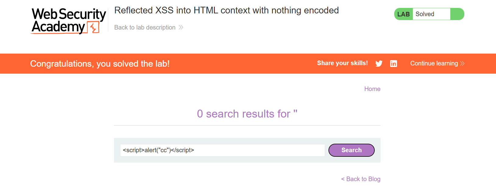
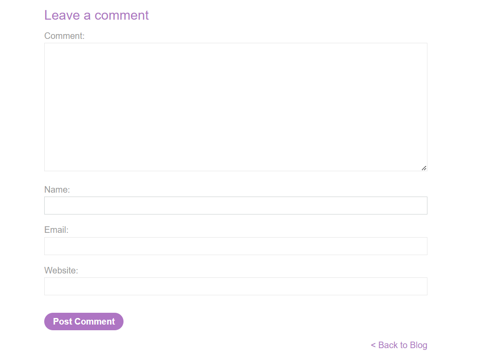
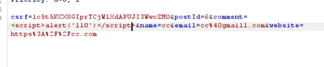
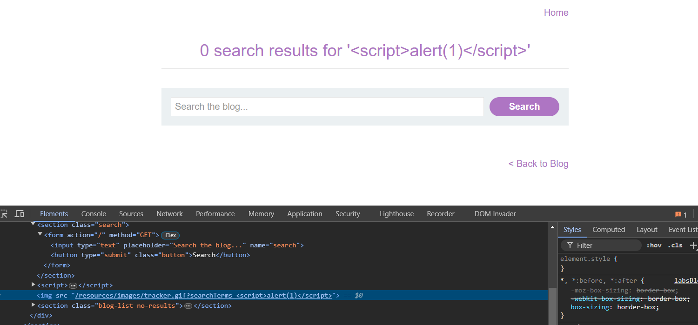
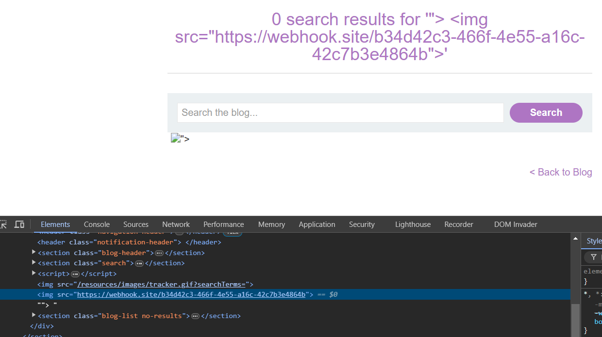
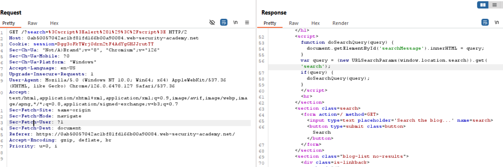

## Reflected XSS into HTML context with nothing encoded

Ta chỉ cần chèn `` vào ô search

## Stored XSS into HTML context with nothing encoded

Ta nhận thấy form này nhận input từ người dùng, sau đó sẽ lưu dữ liệu -> database

## DOM XSS in `document.write` sink using source `location.search`

Ta nhận thấy khi ta submit thì 1 hình ảnh được tạo ra.

Ta chỉ cần đóng thẻ img lại, và định nghĩa 1 thẻ mới.

## DOM XSS in `innerHTML` sink using source `location.search`

Khi ta submit thì nó sẽ nối chuỗi mà mình nhập với innerHTML

