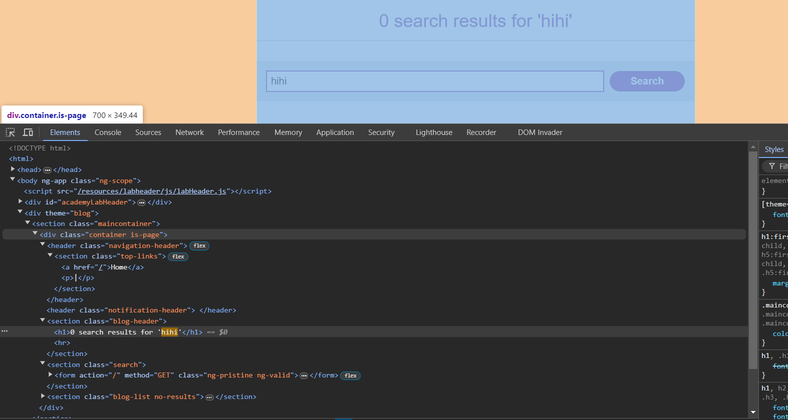

## Reflected XSS into HTML context with nothing encoded

Ta chỉ cần chèn `<script>alert("cc")</script>` vào ô search


## Stored XSS into HTML context with nothing encoded

Ta nhận thấy form này nhận input từ người dùng, sau đó sẽ lưu dữ liệu -> database


## DOM XSS in `document.write` sink using source `location.search`

Ta nhận thấy khi ta submit thì 1 hình ảnh được tạo ra.


Ta chỉ cần đóng thẻ img lại, và định nghĩa 1 thẻ mới.


## DOM XSS in `innerHTML` sink using source `location.search`

Khi ta submit thì nó sẽ nối chuỗi mà mình nhập với innerHTML


## DOM XSS in jQuery anchor href attribute sink using location.search source

We go to submit feedback page 


## Lab: DOM XSS in AngularJS expression with angle brackets and double quotes HTML-encoded

Khi ta submit thì thấy chuỗi ta nhập được đặt trong ng-app


`{{$on.constructor('alert(1)')()}}`


`$on` is event handler function in Angular JS. The $ sign just represents it is a function. `$on.constructor` is constructor function when invoked with parameters executes it's argument passed as a string. Thus passed with argument it is `$on.constructor('alert(1)')` and to denote constructor is a function "()" is added to look like: $on.constructor('alert(1)')(). This is similar to the following snippet in javascript:

```js
function (){
   alert(1);
}
```
## Lab: Reflected DOM XSS


=> escape `"`


## Lab: Reflected XSS into HTML context with most tags and attributes blocked

When I try:


Server send: 


Tag: body is not blocked!


