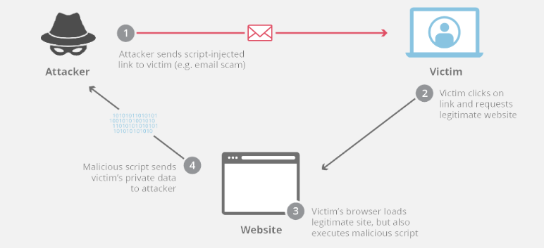
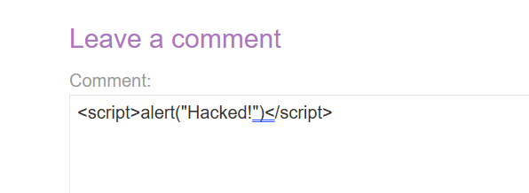

# Cross-site scripting (XSS)

## What is XSS?

Cross-Site Scripting (XSS) attacks are a type of injection, in which malicious scripts are injected into otherwise benign and trusted websites. XSS attacks occur when an attacker uses a web application to send malicious code, generally in the form of a browser side script, to a different end user. Flaws that allow these attacks to succeed are quite widespread and occur anywhere a web application uses input from a user within the output it generates without validating or encoding it.



### What is client-side code?

Client-side code is JavaScript code that runs on a user’s machine. In terms of websites, client-side code is typically code that is executed by the web browser after the browser loads a web page. 

### Example of cross-site scripting?

One useful example of cross-site scripting attacks is commonly seen on websites that have unvalidated comment forums. In this case, an attacker will post a comment consisting of executable code wrapped in `<script></script>` tags. These tags tell a web browser to interpret everything between the tags as JavaScript code. Once that comment is on the page, when any other user loads that website, the malicious code between the script tags will be executed by their web browser, and they will become a victim of the attack.



## How can an attacker use cross-site scripting to cause harm?

Attacker can stole your sensitive data: cookies,...

A typical cross-site scripting attack flow is as follows:

1. The victim loads a webpage and the malicious code copies the user’s cookies
2. The code then sends an HTTP request to an attacker’s webserver with the stolen cookies in the body of the request.
3. The attacker can then use those cookies to impersonate the user on that website for the purpose of a social engineering attack or even to access bank account numbers or other sensitive data.

## What are the types of XSS attacks?

- __Reflected XSS__, where the malicious script comes from the current HTTP request.
- __Stored XSS__, where the malicious script comes from the website's database.
- __DOM-based XSS__, where the vulnerability exists in client-side code rather than server-side code.

### Reflected cross-site scripting

-> Simplest

- Arises when an application receives data in an HTTP request and includes that data within the immediate response in an unsafe way.

```
https://insecure-website.com/status?message=All+is+well.
<p>Status: All is well.</p>
```

```
https://insecure-website.com/status?message=<script>/*+Bad+stuff+here...+*/</script>
<p>Status: <script>/* Bad stuff here... */</script></p>
```

If the user visits the URL constructed by the attacker, then the attacker's script executes in the user's browser, in the context of that user's session with the application. At that point, the script can carry out any action, and retrieve any data, to which the user has access.

### Stored cross-site scripting

is the most dangerous type of XSS

Stored XSS (also known as persistent or second-order XSS) arises when an application receives data from an untrusted source and includes that data within its later HTTP responses in an unsafe way.

The data in question might be submitted to the application via HTTP requests; for example, comments on a blog post, user nicknames in a chat room, or contact details on a customer order. In other cases, the data might arrive from other untrusted sources; for example, a webmail application displaying messages received over SMTP, a marketing application displaying social media posts, or a network monitoring application displaying packet data from network traffic.

Here is a simple example of a stored XSS vulnerability. A message board application lets users submit messages, which are displayed to other users:

```
<p>Hello, this is my message!</p>
```

The application doesn't perform any other processing of the data, so an attacker can easily send a message that attacks other users:

```
<p><script>/* Bad stuff here... */</script></p>
```

### DOM-based cross-site scripting

DOM-based XSS (also known as DOM XSS) arises when an application contains some client-side JavaScript that processes data from an untrusted source in an unsafe way, usually by writing the data back to the DOM.

In the following example, an application uses some JavaScript to read the value from an input field and write that value to an element within the HTML:

```
var search = document.getElementById('search').value;
var results = document.getElementById('results');
results.innerHTML = 'You searched for: ' + search;
```

If the attacker can control the value of the input field, they can easily construct a malicious value that causes their own script to execute:

```
You searched for: 
```

## What can XSS be used for?

- Impersonate or masquerade as the victim user.
- Carry out any action that the user is able to perform.
- Read any data that the user is able to access.
- Capture the user's login credentials.
- Perform virtual defacement of the web site.
- Inject trojan functionality into the web site.


## Impact of XSS vulnerabilities

- In a brochureware application, where all users are anonymous and all information is public, the impact will often be minimal.
- In an application holding sensitive data, such as banking transactions, emails, or healthcare records, the impact will usually be serious.
- If the compromised user has elevated privileges within the application, then the impact will generally be critical, allowing the attacker to take full control of the vulnerable application and compromise all users and their data.

## How to detect?
### XSS Using Script in Attributes

XSS attacks may be conducted without using `<script>...</script>` tags. Other tags will do exactly the same thing, for example: `<body onload=alert('test1')>` or other attributes like: `onmouseover`, `onerror`.

__onmouseover__ : `<b onmouseover=alert('Wufff!')>click me!</b>`

__onerror__ : ``

### XSS Using Script Via Encoded URI Schemes

If we need to hide against web application filters we may try to encode string characters, e.g.: `a=&\#X41 (UTF-8)` and use it in IMG tags:

``

## How to exploit

## How to prevent XSS attacks

- Filter input on arrival
- Encode data on output
- Use appropriate response headers
- Content Security Policy